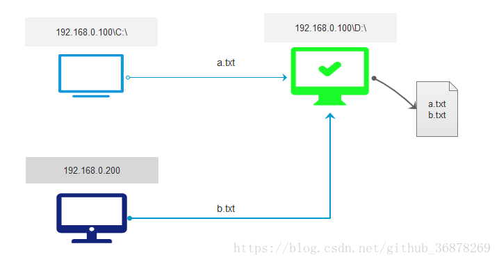
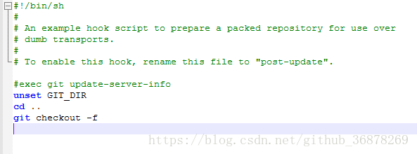
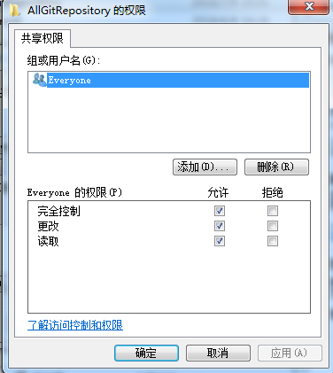
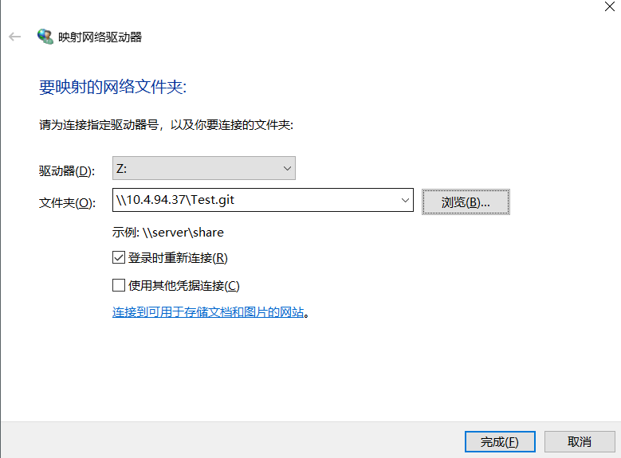
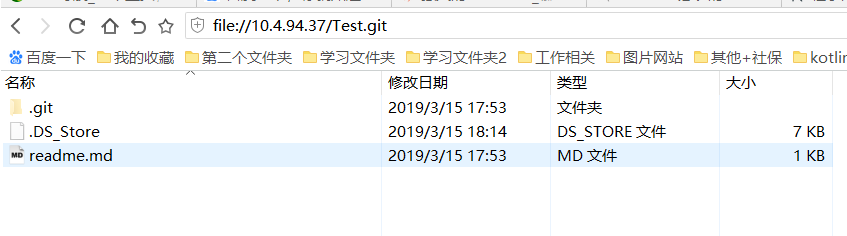

# Git 本地局域网Git仓库互联，以及Git仓库一对多推送

本地局域网Git仓库互联，以及Git仓库一对多推送(局域网内也可提交)

### 功能需求
* 创建根仓库(总仓库，比如本机D盘)里文件可见。
* 本地仓库(C盘仓库)可关联根仓库(D盘仓库)并提交。
* 局域网其他机器可访问根仓库并可向根仓库提交。
* 一个根仓库推送不同的远端仓库。


### 准备环境
* 两台机器都安装了git。
* 两台机器可以ping通。

### 功能实现
#### 根仓库的搭建
1.机器A,建一个空文件夹来做仓库，例如 Test.git

```java
mkdir Test.git
```
2.进入该文件夹，初始化git仓库(也可以构建裸仓库，只允许拉取和推送 git init --bare)
```java
git init
```
pwd查看仓库路径,例如：/e/fn_code/code_pri_git_server/Test.git

3.在根仓库下(Test.git文件夹内)执行以下命令，配置接收忽略分支
```java
git config --global receive.denyCurrentBranch ignore
```
4.修改根仓库.git/hooks/post-update.sample文件，删除其他代码，在最下边添加以下代码
```java
unset GIT_DIR
cd ..
git checkout -f
```

将该文件后缀删除，变为post-update，post-update文件内容如下：




这样，本地的根仓库就搭建好了。

#### 本地仓库关联根仓库(Test.git)并提交

1.机器A,本地仓库构建
```java
git init
```
2.自己的仓库连接根仓库
```java
git remote add origin /e/fn_code/code_pri_git_server/Test.git
```
通过git remote -v 查看是否建立关联

3.在自己的仓库中向根仓库做提交， git push 仓库名 分支名
```java
git push origin master
```
4.在自己的仓库中做拉取， git pull 仓库名 分支名
```java
git pull origin master
```

#### 局域网内其他机器访问根仓库并向根仓库提交
其他机器(机器B)访问根仓库(机器A)，只需要将根仓库文件夹共享就可以(添加密码验证)。

1.将根仓库共享。
右键根仓库目录—>属性—>共享—>高级共享—->勾选共享此文件夹—->权限如下,要对所有人开发:



2.在另一台计算机（机器B）上右键计算机—>映射网络驱动器：
输入根仓库地址比如： \\IP\仓库名称  ，如果需要输入密码，输入另一台电脑的登录密码




在浏览器中验证是否可以访问:
```Java
\\10.4.94.37\Test.git
```


3.上述步骤将根仓库（机器A）的地址映射为了Z:（机器B），要提交到该地址，需要将机器B的本地仓库关联到机器B的本地的Z:目录下。其他拉取和提交的步骤和在机器A中一样。
机器B本地仓库与Z:(根仓库在本地的映射)建立关联：
```Java
建立关联：
$ git remote add origin Z:
拉取：
git pull origin master
推送：
git push origin master
克隆：
git clone Z:
```

#### 一个git本地仓库，推送多个远程仓库（同样，多个本地仓库也可以）
1.连接远程仓库
```Java
git remote add origin https://github.com/liujianguangnice/MultiRepDouble.git
```
2.连接第二个
```Java
添加一个远程库 名字不能重复，用mirror
git remote add mirror https://github.com/liujianguangnice/MultiRepOne.git
```

3.拉取其中一个仓库（mirror）代码：
```Java
git pull mirror master
```
如果拉取出错，那么用下面的命令，把完全不相关的库合并(强制关联)
```Java
git pull mirror master --allow-unrelated-histories
```

4.推送到远端仓库:
git push origin   本地分支名：远程分支名（也可：git push origin    远程分支名）
```Java
#推送数据到origin仓库的master分支
git push origin master
```

想一次推送两个仓库的话,使用set-url添加另外一个远程库：
```Java
git remote set-url --add origin https://github.com/liujianguangnice/MultiRepOne.git
#提交代码直接推送，两个库别名叫origin的库都会更新
git push origin master
```
5.删除仓库关联
```Java
git remote rm mirorr
```